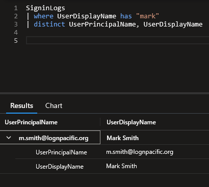
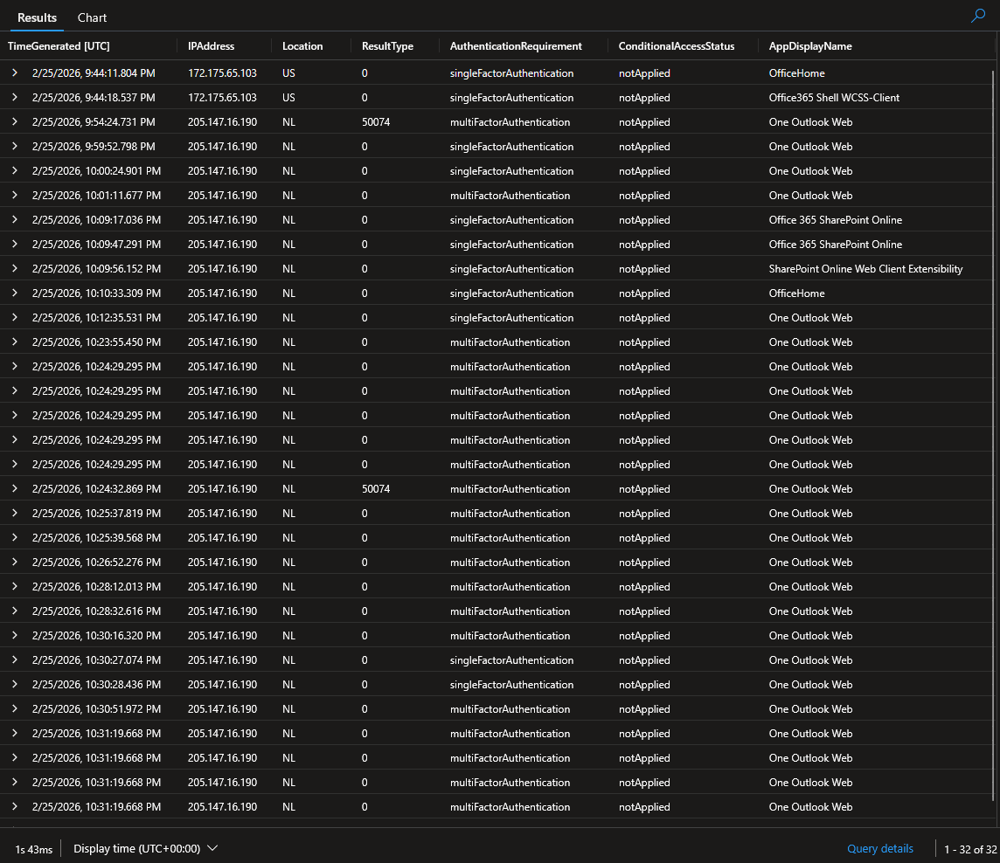
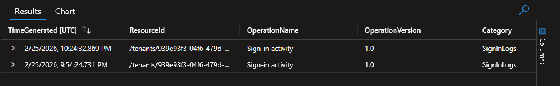
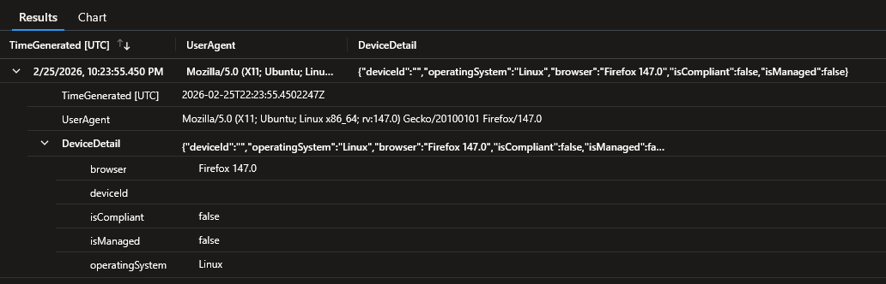
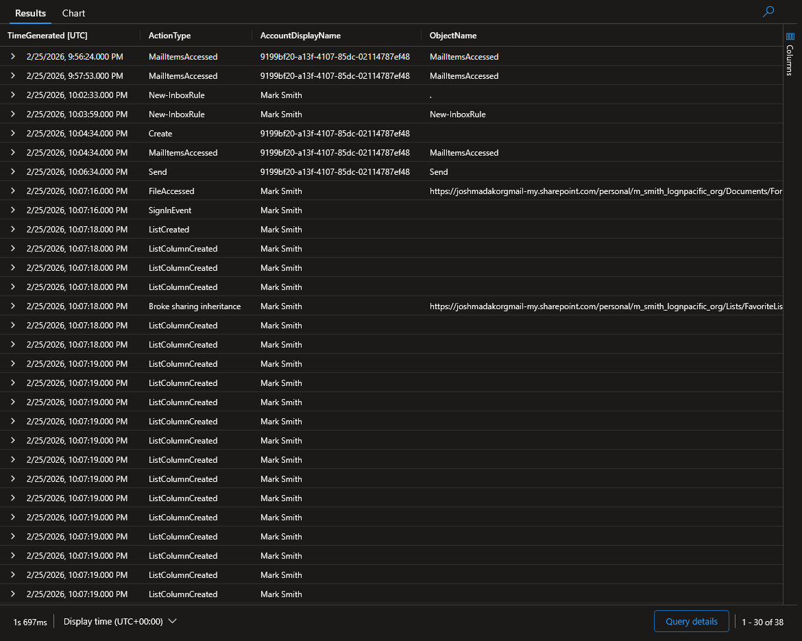
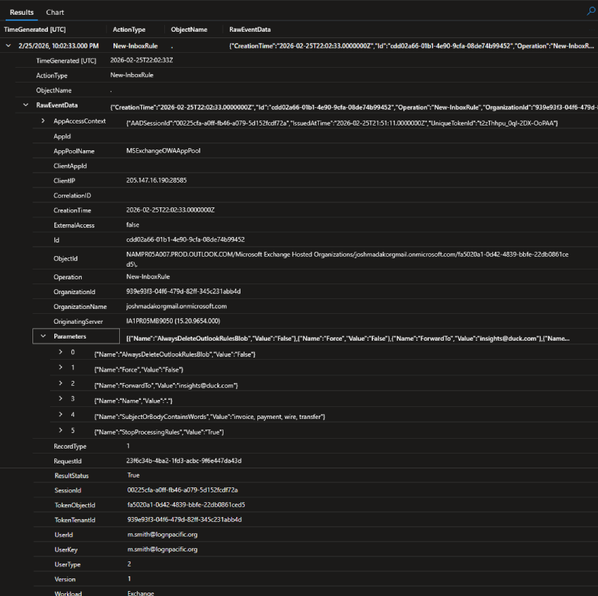

# Threat Hunt: Scattered Spider BEC
### Microsoft Sentinel / Log Analytics Workspace | BEC Investigation

---

| | |
|---|---|
| **Environment** | Microsoft Sentinel / Log Analytics Workspace (`law-cyber-range`) |
| **Analyst** | *[Katie aka ktx0r]* |
| **Hunt Type** | Hypothesis-Driven / Incident-Triggered |
| **Telemetry** | `SigninLogs` · `CloudAppEvents` · `EmailEvents` |
| **Hunt Window** | 2026-02-25 21:00 UTC → 2026-02-26 00:00 UTC |
| **Threat Actor** | Scattered Spider (UNC3944 / Octo Tempest) |
| **Verdict** | ⚠ Confirmed Threat: Full BEC Kill Chain |
| **Financial Exposure** | £24,500 fraudulent wire transfer (frozen by external bank fraud detection) |

---

## Table of Contents

1. [Executive Summary](#1-executive-summary)
2. [Hypothesis & Scope](#2-hypothesis--scope)
3. [Investigation](#3-investigation)
4. [Attack Timeline](#4-attack-timeline)
5. [Confirmed Findings](#5-confirmed-findings)
6. [MITRE ATT&CK Mapping](#6-mitre-attck-mapping)
7. [Detection Gaps](#7-detection-gaps)
8. [Recommendations](#8-recommendations)
9. [Detection Rules Created](#9-detection-rules-created)
10. [Final Assessment](#10-final-assessment)
11. [Analyst Notes](#11-analyst-notes)
12. [Lessons Learned & Next Hunt Hypotheses](#12-lessons-learned--next-hunt-hypotheses)
13. [Evidence Index](#13-evidence-index)

---

## 1. Executive Summary

In this hunt, I investigated a confirmed Business Email Compromise targeting the finance department of LogN Pacific Financial Services. The hunt was conducted entirely in Microsoft Sentinel's Log Analytics Workspace across three data sources covering a two-hour window on the evening of 25 February 2026.

The full attack chain was confirmed and attributed to **Scattered Spider (UNC3944)**, a financially motivated group known for targeting MGM Resorts, Caesars Entertainment, and multiple UK financial institutions. The attacker used pre-obtained credentials to bypass MFA through push bombing, accessed the victim's mailbox via Outlook Web, created two covert inbox rules to forward financial emails and delete security alerts, then sent a thread-hijacked BEC email that resulted in a **£24,500 fraudulent wire transfer attempt**.

The entire attack, from MFA approval to fraud email, took **under 35 minutes** and triggered zero internal alerts. Funds were only frozen because the bank caught it externally.

---

## 2. Hypothesis & Scope

### Hypothesis

> *"A threat actor has obtained valid credentials for an internal finance account and is actively using that access to intercept financial communications and execute wire transfer fraud."*

### Hunt Trigger

The hunt was initiated after the bank flagged a suspicious £24,500 wire transfer. Finance reported receiving an email from Mark Smith with updated vendor banking details. Smith confirmed he had been getting repeated MFA push notifications the night before and approved one to make them stop. I scoped the investigation to the 21:00-23:00 UTC window on 25 February 2026.

### Data Sources

| Source | Platform | Coverage |
|---|---|---|
| `SigninLogs` | Microsoft Entra ID | Authentication events, MFA status, device and location data |
| `CloudAppEvents` | Microsoft Defender for Cloud Apps | Mailbox activity, inbox rule creation, cloud app access |
| `EmailEvents` | Microsoft Defender for Office 365 | Email send/receive events, sender IP, direction, subject |

---

## 3. Investigation

### Phase 1: Identity Confirmation

I started by confirming the identity of the user named in the bank fraud alert, querying `SigninLogs` for Mark Smith's account.

```kql
SigninLogs
| where UserDisplayName has "mark"
| distinct UserPrincipalName, UserDisplayName
```



**Result:** `m.smith@lognpacific.org` confirmed. All subsequent queries pivot on this account and the attacker IP identified in Phase 2.

---

### Phase 2: Authentication Analysis

I pulled the full sign-in history for Mark's account across the attack window, sorted chronologically. I filtered to the result types most relevant to MFA fatigue: successful authentications (`0`), MFA not satisfied (`50074`), and MFA interrupt (`50140`).

```kql
SigninLogs
| where UserPrincipalName == "m.smith@lognpacific.org"
| where TimeGenerated between (datetime(2026-02-25T21:00:00Z) .. datetime(2026-02-26T00:00:00Z))
| where ResultType in (0, 50074, 50140)
| project TimeGenerated, IPAddress, Location, ResultType,
          AuthenticationRequirement, ConditionalAccessStatus
| order by TimeGenerated asc
```



**Result:** Two IPs in the logs:
- `172.175.65.103` (US): Mark's legitimate daytime session, `ResultType 0`
- `205.147.16.190` (NL): attacker IP, with the following sequence:
  - `ResultType 50074` x2 (MFA required, not satisfied)
  - `ResultType 50140` x1 (MFA interrupt)
  - `ResultType 0` (successful authentication)

This is a classic MFA fatigue pattern: push notifications sent repeatedly until the user approves one. Mark confirmed this is exactly what happened — he kept getting prompted on his phone and eventually tapped approve just to make it stop. That single tap gave the attacker a fully authenticated session.

`ConditionalAccessStatus: notApplied` on the successful session confirms no CA policy was evaluated or enforced. In plain terms: there was a security policy that should have required additional verification before allowing a login from an unknown location or device. It wasn't applied to Mark's account. That's the root cause of the entire compromise.

```kql
SigninLogs
| where UserPrincipalName == "m.smith@lognpacific.org"
| where IPAddress == "205.147.16.190"
| where ResultType == 50074
| count
```



**Result:** 2 × `ResultType 50074` from the attacker IP within the attack window.

---

### Phase 3: Device Profile Analysis

I queried the device and browser details on the attacker session to confirm it wasn't coming from a managed corporate endpoint.

```kql
SigninLogs
| where UserPrincipalName == "m.smith@lognpacific.org"
| where IPAddress == "205.147.16.190"
| where ResultType == 0
| project TimeGenerated, UserAgent, DeviceDetail
| take 1
```



**Result:** The session came from an unmanaged Ubuntu Linux machine running Firefox 147.0 — nothing like Mark's normal managed Windows / Edge baseline.

In plain terms: every company-issued laptop has software on it that identifies it as a trusted device. The machine that logged into Mark's account had none of that. It looked nothing like any device the company had ever seen Mark use. That's a major red flag that should have blocked the login automatically.

| Field | Value |
|---|---|
| Operating System | Linux (Ubuntu) |
| Browser | Firefox 147.0 |
| isManaged | false |
| isCompliant | false |
| UserAgent | `Mozilla/5.0 (X11; Ubuntu; Linux x86_64; rv:147.0) Gecko/20100101 Firefox/147.0` |

Three anomaly signals on one session: foreign country, unmanaged OS, non-corporate browser. No alert fired on any of them.

---

### Phase 4: Post-Authentication Activity

I pivoted to `CloudAppEvents` and pulled everything the attacker did after gaining access, sorted ascending to see the sequence in order.

```kql
CloudAppEvents
| where TimeGenerated between (datetime(2026-02-25T21:00:00Z) .. datetime(2026-02-26T00:00:00Z))
| where IPAddress == "205.147.16.190"
| project TimeGenerated, ActionType, AccountDisplayName, ObjectName, RawEventData
| order by TimeGenerated asc
```



**Result:** The full post-authentication sequence:

| Time (UTC) | ActionType | Significance |
|---|---|---|
| 21:56 | `MailItemsAccessed` | Reading the inbox before doing anything else |
| 21:57 | `MailItemsAccessed` | Continued reconnaissance |
| 22:02 | `New-InboxRule` | Rule 1 created (name: `.`) |
| 22:03 | `New-InboxRule` | Rule 2 created (name: `..`) |
| 22:04 | `Create` | Fraud email drafted |
| 22:04 | `MailItemsAccessed` | Final inbox check before sending |
| 22:06 | `Send` | BEC email sent |
| 22:07 | `FileAccessed` | OneDrive file accessed |
| 22:07 | `SignInEvent` | SharePoint session established |
| 22:07+ | `ListCreated`, `ListColumnCreated` | SharePoint/OneDrive structure modified |
| 22:07+ | `Broke sharing inheritance` | File sharing permissions altered |

The attacker read the inbox before setting up persistence — they needed to understand Mark's vendor relationships and active threads to make the fraud convincing. That sequencing is intentional.

---

### Phase 5: Inbox Rule Analysis

I expanded the `RawEventData` on both `New-InboxRule` events to document the full rule configuration.

```kql
CloudAppEvents
| where TimeGenerated between (datetime(2026-02-25T21:00:00Z) .. datetime(2026-02-26T00:00:00Z))
| where IPAddress == "205.147.16.190"
| where ActionType == "New-InboxRule"
| project TimeGenerated, ActionType, ObjectName, RawEventData
| order by TimeGenerated asc
```




**Rule 1: Financial Collection (name: `.`)**

| Parameter | Value |
|---|---|
| Name | `.` (single period) |
| ForwardTo | `insights@duck.com` |
| SubjectOrBodyContainsWords | `invoice, payment, wire, transfer` |
| StopProcessingRules | `True` |
| CreationTime | `2026-02-25T22:02:33Z` |
| SessionId | `00225cfa-a0ff-fb46-a079-5d152fcdf72a` |


**Rule 2: Security Alert Suppression (name: `..`)**

| Parameter | Value |
|---|---|
| Name | `..` (double period) |
| SubjectOrBodyContainsWords | `suspicious, security, phishing, unusual, compromised, verify` |
| DeleteMessage | `True` |
| StopProcessingRules | `True` |

Rule 1 forwards financial emails to an attacker-controlled address. Rule 2 permanently deletes any security alert emails before Mark can see them. Both rules use `StopProcessingRules: True` to take priority over any legitimate rules.

The rule names — `.` and `..` — are worth calling out specifically. Inbox rules normally have descriptive names like "Move newsletters to folder." A single period is essentially invisible when you're scanning a list. It's designed to be skipped over. That's not an accident.

---

### Phase 6: Fraud Execution

I pivoted to `EmailEvents` to find the fraudulent email and confirm it came from the same attacker session.

```kql
EmailEvents
| where TimeGenerated between (datetime(2026-02-25T21:00:00Z) .. datetime(2026-02-26T00:00:00Z))
| where SenderIPv4 == "205.147.16.190"
| project TimeGenerated, SenderFromAddress, RecipientEmailAddress,
          Subject, EmailDirection, SenderIPv4
```


**Result:**

| Field | Value |
|---|---|
| Timestamp | `2026-02-25T22:06:39Z` |
| Sender | `m.smith@lognpacific.org` |
| Recipient | `j.reynolds@lognpacific.org` |
| Subject | `RE: Invoice #INV-2026-0892 - Updated Banking Details` |
| Direction | `Intra-org` |
| Sender IP | `205.147.16.190` |

The `RE:` prefix confirms thread hijacking — the attacker found an active invoice conversation during Phase 4 and inserted fraudulent banking details as a reply. `Intra-org` delivery bypassed all external email filters. The sender IP matches the attacker's sign-in IP, confirming this came from the same session.

The `Intra-org` direction is significant beyond the technical detail: it means the email traveled entirely within the company's own email system, between two employees. All the filters designed to catch suspicious emails from outside the organization — spam filters, phishing detection, sender reputation checks — don't apply to emails between internal accounts. The attacker used a compromised internal account specifically because it bypasses the layer of security most companies focus on.

---

### Phase 7: Scope Expansion

I checked `CloudAppEvents` for any cloud storage access beyond the mailbox to assess the full data exposure footprint.

```kql
CloudAppEvents
| where TimeGenerated between (datetime(2026-02-25T21:00:00Z) .. datetime(2026-02-26T00:00:00Z))
| where IPAddress == "205.147.16.190"
| where ActionType != "MailItemsAccessed"
    and ActionType != "New-InboxRule"
    and ActionType != "Send"
| project TimeGenerated, ActionType, Application, AccountDisplayName, ObjectName
| order by TimeGenerated asc
```


**Result:** After sending the fraud email, the attacker accessed:
- `Microsoft OneDrive for Business`: file access, list creation, sharing permission changes
- `Microsoft SharePoint Online`: session established, additional list activity

The `Broke sharing inheritance` events indicate the attacker changed file permissions on OneDrive items, possibly staging files for external access. In plain terms: they didn't just read files — they changed who was allowed to access them, which is a common step before exfiltrating data out of an organization. Full data exposure scope requires a dedicated file access audit.

---

### Phase 8: Session Correlation

All attacker activity across all three tables ties back to a single authenticated session.

**Session ID:** `00225cfa-a0ff-fb46-a079-5d152fcdf72a`

Confirmed in:
- `SigninLogs`: successful authentication event
- `CloudAppEvents`: `AppAccessContext.AADSessionId` in Rule 1 RawEventData
- `EmailEvents`: correlates to the same session

This confirms the entire kill chain was one operator, one session.

---

## 4. Attack Timeline

```
── PRE-COMPROMISE ────────────────────────────────────────────────────────────

  [Prior to hunt window]
       Infostealer malware harvests credentials for m.smith@lognpacific.org
       Credential logs acquired by Scattered Spider operator

── INITIAL ACCESS ────────────────────────────────────────────────────────────

  2026-02-25
  21:54 UTC     MFA push bombing begins from 205.147.16.190 (Netherlands)
  21:54-21:58   Two ResultType 50074 + one ResultType 50140 from attacker IP
  ~21:59 UTC    Mark approves MFA prompt, attacker gains authenticated session
                OS: Ubuntu Linux / Browser: Firefox 147.0
                isManaged: false / isCompliant: false
                ConditionalAccessStatus: notApplied

── RECONNAISSANCE ────────────────────────────────────────────────────────────

  21:56 UTC     First post-auth action: MailItemsAccessed
  21:57 UTC     Continued mailbox reading, vendor threads and invoice context

── PERSISTENCE ───────────────────────────────────────────────────────────────

  22:02 UTC     Rule 1 created (name: ".")
                Forwards finance-keyword mail to insights@duck.com
                StopProcessingRules: True

  22:03 UTC     Rule 2 created (name: "..")
                Permanently deletes security alert emails
                DeleteMessage: True / StopProcessingRules: True

── FRAUD EXECUTION ───────────────────────────────────────────────────────────

  22:04 UTC     Fraud email drafted using intercepted invoice context
  22:06 UTC     Email sent to j.reynolds@lognpacific.org
                Subject: RE: Invoice #INV-2026-0892 - Updated Banking Details
                Direction: Intra-org
                Sender IP: 205.147.16.190

── SCOPE EXPANSION ───────────────────────────────────────────────────────────

  22:07 UTC     Microsoft OneDrive for Business accessed
                FileAccessed, ListCreated, Broke sharing inheritance
  22:07 UTC     Microsoft SharePoint Online session established
                Session ID: 00225cfa-a0ff-fb46-a079-5d152fcdf72a

── DETECTION & CONTAINMENT ───────────────────────────────────────────────────

  2026-02-26    External bank fraud detection flags £24,500 wire transfer
                Funds frozen
  [Post-event]  Hunt initiated, kill chain confirmed across 3 data sources
                Sessions revoked, inbox rules deleted, credentials rotated
```

---

## 5. Confirmed Findings

### Finding 1: Account Compromise via MFA Fatigue

| | |
|---|---|
| **Severity** | 🔴 Critical |
| **Account** | `m.smith@lognpacific.org` |
| **Attacker IP** | `205.147.16.190` (Netherlands) |
| **MFA Attempts** | 3 total: 2x `ResultType 50074`, 1x `ResultType 50140` |
| **Root Enabler** | `ConditionalAccessStatus: notApplied` |
| **Evidence** | SigninLogs: MFA failure sequence → ResultType 0 |

The attacker generated repeated MFA push notifications until Mark approved one. No Conditional Access policy was enforced on the session despite a foreign IP, unmanaged device, and new geolocation all being present at the same time.

---

### Finding 2: Persistent Collection via Covert Inbox Rules

| | |
|---|---|
| **Severity** | 🔴 Critical |
| **Account** | `m.smith@lognpacific.org` |
| **Rule 1** | Name: `.`, forwards finance keywords to `insights@duck.com` |
| **Rule 2** | Name: `..`, permanently deletes security alert emails |
| **Created** | 22:02 and 22:03 UTC, 3 minutes after gaining access |
| **Evidence** | CloudAppEvents: New-InboxRule x2, RawEventData parameters |

Two rules created in under 90 seconds: one for collection, one for suppression. Both use `StopProcessingRules: True`. Rule 2 uses `DeleteMessage: True` — these emails weren't just redirected, they were permanently deleted. If Mark had gone looking for a security alert from Microsoft about an unusual login, there wouldn't have been one to find.

---

### Finding 3: Thread-Hijacked BEC / Fraudulent Wire Transfer

| | |
|---|---|
| **Severity** | 🔴 Critical |
| **Target** | `j.reynolds@lognpacific.org` |
| **Amount** | £24,500 |
| **Method** | Reply to active invoice thread with substituted banking details |
| **Outcome** | Wire transfer initiated, frozen by external bank fraud detection |
| **Evidence** | EmailEvents: sender IP match, Intra-org direction, RE: subject prefix |

The attacker used context from the mailbox reconnaissance phase to craft a convincing reply to a real invoice thread. It was delivered internally, bypassing all external controls. The bank caught it. No internal control did.

---

### Finding 4: Cloud Storage Access and Permission Modification

| | |
|---|---|
| **Severity** | 🟠 High |
| **Scope** | Microsoft OneDrive for Business, Microsoft SharePoint Online |
| **Notable** | `Broke sharing inheritance` events: permissions altered on files/folders |
| **Status** | Full data exposure scope requires targeted file access audit |
| **Evidence** | CloudAppEvents: FileAccessed, ListCreated, Broke sharing inheritance |

After the fraud email was sent, the attacker accessed OneDrive and SharePoint and modified sharing permissions on files. The extent of what was accessed or staged for exfiltration is still being assessed.

---

### Finding 5: Conditional Access Policy Gap (Root Cause)

| | |
|---|---|
| **Severity** | 🟠 High |
| **Evidence** | `ConditionalAccessStatus: notApplied` on successful attacker session |
| **Impact** | MFA enforcement not applied; single-factor auth succeeded from foreign IP |

The compromised account was not covered by a Conditional Access policy. In plain terms: Conditional Access is a set of rules that say "before we let someone log in, check where they're coming from, what device they're on, and whether we trust it." Those rules existed in this environment — they just weren't applied to Mark's account. This is the single gap that made everything else possible. The tools to prevent it exist natively in M365. They weren't configured.

---

## 6. MITRE ATT&CK Mapping

| Technique ID | Name | Tactic | Observed |
|---|---|---|---|
| T1078 | Valid Accounts | Initial Access / Persistence | Pre-obtained credentials used throughout |
| T1621 | MFA Request Generation | Credential Access | Push bombing, 3 attempts before success |
| T1114.002 | Remote Email Collection | Collection | MailItemsAccessed via Outlook Web |
| T1114.003 | Email Forwarding Rule | Collection | Rule 1 forwarding finance keywords externally |
| T1564.008 | Email Hiding Rules | Defense Evasion | Rules named `.` and `..` |
| T1070 | Indicator Removal | Defense Evasion | Rule 2 permanently deleting security alerts |
| T1566.002 | Spearphishing Link | Initial Access | Thread-hijacked BEC email |
| T1213.002 | Data from SharePoint | Collection | OneDrive and SharePoint accessed post-compromise |
| T1657 | Financial Theft | Impact | £24,500 fraudulent wire transfer |

**Threat Actor:** Scattered Spider (UNC3944 / Octo Tempest / G1015)

---

## 7. Detection Gaps

| Gap | Impact | Evidence |
|---|---|---|
| Conditional Access not enforced | MFA bypass succeeded | `ConditionalAccessStatus: notApplied` |
| No MFA fatigue detection | 3 failures + success from same IP went unalerted | No alert fired |
| No inbox rule creation alerting | Two covert rules active with no detection | No alert on `New-InboxRule` |
| No impossible travel alerting | Netherlands login not flagged | No alert on first-time country |
| No device compliance enforcement | Unmanaged Linux device granted full M365 access | `isManaged: false` |
| External auto-forwarding not blocked | Financial emails forwarded externally unimpeded | No transport rule |
| No intra-org BEC detection | Fraudulent email delivered without inspection | `Intra-org` bypasses filters |

---

## 8. Recommendations

### Immediate: 0 to 72 Hours
1. **Revoke all active sessions** for `m.smith@lognpacific.org` and force credential rotation
2. **Delete both inbox rules** (`.` and `..`) from the compromised mailbox
3. **Audit all finance department mailboxes** for similar rule patterns
4. **Block `insights@duck.com`** at the email gateway
5. **Confirm with j.reynolds** no payment was processed; preserve the email thread

### Short-Term: 1 to 2 Weeks
6. **Enforce Conditional Access universally**, migrating finance and executive roles to phishing-resistant MFA (FIDO2 / number matching)
7. **Block external auto-forwarding** via Exchange transport rule
8. **Deploy Sentinel detection rules** for inbox rule anomalies and MFA fatigue (see §9)
9. **Enable impossible travel and new-ASN alerts** in Entra ID
10. **Enforce device compliance** in Conditional Access, blocking unmanaged devices

### Strategic: 30 to 90 Days
11. **Enable Continuous Access Evaluation (CAE)** to reduce session token reuse window
12. **Implement Defender for Office 365 Safe Links** with real-time detonation
13. **Establish out-of-band vendor payment verification**: banking detail changes require phone confirmation to a known contact
14. **Conduct BEC awareness training** for finance staff, covering thread hijacking and payment redirect red flags
15. **Implement MFA push rate limiting**: account lockout after N consecutive failures

---

## 9. Detection Rules Created

Two Sentinel analytics rules were written as a direct output of this hunt.

---

**Rule 1: Suspicious Inbox Rule / Minimal or Obfuscated Name**

Fires when an inbox rule is created with a blank, single-character, or dot-pattern name.
Severity: **High** | MITRE: T1564.008

```kql
CloudAppEvents
| where ActionType == "New-InboxRule"
| extend RuleName = tostring(parse_json(RawEventData).ObjectName)
| where RuleName in ("", ".", "..")
    or string_size(RuleName) <= 2
| project TimeGenerated, AccountDisplayName, RuleName,
          IPAddress, ActionType, RawEventData
| order by TimeGenerated desc
```

---

**Rule 2: MFA Fatigue / Repeated Failures Followed by Successful Authentication**

Fires when 2+ `ResultType 50074` events from the same IP are followed by `ResultType 0` within a 15-minute window for the same user.
Severity: **Critical** | MITRE: T1621, T1078

```kql
let failures = SigninLogs
| where ResultType == 50074
| project FailTime = TimeGenerated, UserPrincipalName, IPAddress;
let successes = SigninLogs
| where ResultType == 0
| project SuccessTime = TimeGenerated, UserPrincipalName, IPAddress;
failures
| join kind=inner successes on UserPrincipalName, IPAddress
| where SuccessTime between (FailTime .. (FailTime + 15m))
| summarize FailCount = count(), FirstFail = min(FailTime),
            Success = min(SuccessTime) by UserPrincipalName, IPAddress
| where FailCount >= 2
| project UserPrincipalName, IPAddress, FailCount, FirstFail, Success
```

---

## 10. Final Assessment

This hunt confirmed a complete six-stage BEC kill chain executed in under 35 minutes with zero internal alerts. The £24,500 wire transfer was stopped by the bank, not by anything inside the organization.

**Open Risk Items:**

| Risk | Status | Severity |
|---|---|---|
| Conditional Access not enforced | Open, remediation in progress | 🔴 Critical |
| External auto-forwarding not blocked | Open | 🔴 Critical |
| No inbox rule creation alerting | Resolved, rules deployed | ✅ Mitigated |
| No MFA fatigue detection | Resolved, rules deployed | ✅ Mitigated |
| Device compliance not enforced | Open | 🟠 High |
| No vendor payment change protocol | Open | 🟠 High |
| CAE not enabled | Open | 🟡 Medium |
| OneDrive/SharePoint data exposure scope | Under assessment | 🟠 High |

The attack succeeded because of policy gaps, not missing technology. Everything needed to prevent this exists in the M365 stack. Until Conditional Access is enforced and external forwarding is blocked, this organization is still exposed.

---

## 11. Analyst Notes

The two-rule combination is the most interesting part of this investigation. Rule 1 is the expected play: forward financial emails to an external address. Rule 2 is what sets this apart. The keyword list (`suspicious`, `security`, `phishing`, `unusual`, `compromised`, `verify`) maps almost exactly to the language Microsoft uses in its own anomalous sign-in notification emails. The attacker built a counter-detection layer specifically designed to suppress Microsoft's native alerting. That's not opportunistic, that's a tested playbook.

`DeleteMessage: True` on Rule 2 is worth noting separately. These emails weren't moved to a folder. They were gone. If Mark had gone looking for a security notification from Microsoft, he wouldn't have found one.

The 35-minute window from MFA approval to fraud email is fast but not frantic. Reconnaissance was 6 minutes. Rule creation was under 2 minutes. Fraud execution was 3 minutes. The rest was scope expansion. That pace suggests someone who has run this sequence before.

The `Intra-org` email direction is the detail that tends to get overlooked after the fact. External phishing defenses: SPF, DKIM, DMARC, Safe Links, don't apply to email between two internal M365 accounts. The attacker used a compromised internal account precisely because it bypasses the controls organizations spend the most time on. Detection here has to be identity-first.

The `Broke sharing inheritance` events in OneDrive are still unresolved. Most BEC post-incident analysis stops at the email chain and the wire transfer. The file permission changes here suggest the attacker may have been staging data beyond the immediate fraud. That's worth a follow-on investigation.

---

## 12. Lessons Learned & Next Hunt Hypotheses

### What This Hunt Demonstrated

- A full BEC kill chain is reconstructable from three M365 tables. No single source tells the whole story.
- Zero alerts in 35 minutes of attacker activity is a finding in itself, not just an absence of findings.
- Dot-pattern rule names and security keyword deletion lists are more reliable detection signals than IP addresses.
- Reconnaissance before persistence is a reliable indicator of a targeted operation vs. opportunistic account abuse.

### What Could Be Done Faster

- Checking `ConditionalAccessStatus` earlier would have identified the root cause faster.
- `RawEventData` on inbox rule events should be queried immediately in any BEC investigation. The parameters tell the whole persistence story in one view.
- Session ID correlation across all three tables should happen early to confirm single-actor attribution.

### Next Hunt Hypotheses

> **H-001:** *"The attacker IP 205.147.16.190 appears in sign-in attempts against other accounts outside the confirmed hunt window. Finance may not have been the only target."*

> **H-002:** *"Files accessed or permission-modified in OneDrive during this session were staged for external access. A file audit against session ID `00225cfa-a0ff-fb46-a079-5d152fcdf72a` may identify data that left the environment."*

> **H-003:** *"The infostealer that harvested Mark's credentials may still be active on a device in scope. EDR telemetry predating this hunt window may show credential harvesting activity not visible in cloud identity logs."*

---

## 13. Evidence Index

| ID | Screenshot File | Source | Description |
|---|---|---|---|
| E-01 | `01-identity-pivot.png` | `SigninLogs` | m.smith@lognpacific.org confirmed as compromised account |
| E-02 | `02-signin-sequence.png` | `SigninLogs` | Full auth sequence: 50074 x2, 50140 x1, ResultType 0; two IPs visible |
| E-03 | `03-mfa-count.png` | `SigninLogs` | Count query confirming 2x ResultType 50074 from attacker IP |
| E-04 | `04-device-profile.png` | `SigninLogs` | Ubuntu Linux, Firefox 147.0, isCompliant: false, isManaged: false |
| E-05 | `05-cloudappevents-sequence.png` | `CloudAppEvents` | Full post-auth activity: MailItemsAccessed → rules → Send → SharePoint |
| E-06 | `06-rule1-parameters.png` | `CloudAppEvents` | Rule 1 RawEventData: name, ForwardTo, keywords, session ID |
| E-07 | `07-rule1-continued.png` | `CloudAppEvents` | Rule 1 continued: StopProcessingRules, SessionId, UserId, ResultStatus |
| E-08 | `08-rule2-parameters.png` | `CloudAppEvents` | Rule 2 parameters: name `..`, deletion keywords, DeleteMessage: True |
| E-09 | `09-fraud-email.png` | `EmailEvents` | Fraudulent BEC email: recipient, subject, Intra-org, sender IP match |
| E-10 | `10-scope-expansion.png` | `CloudAppEvents` | OneDrive/SharePoint access: FileAccessed, Broke sharing inheritance |
| E-11 | | `SigninLogs` | Session ID `00225cfa-a0ff-fb46-a079-5d152fcdf72a`, visible in E-06/E-07 |
| E-12 | | Sentinel | Detection Rule 1: Suspicious Inbox Rule, Minimal Name |
| E-13 | | Sentinel | Detection Rule 2: MFA Fatigue Pattern |

---

*[Katie aka ktx0r] · [4/17/2026]*
*Microsoft Sentinel Lab*
*Scattered Spider BEC Investigation (Simulated)*
